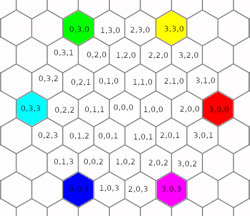

# Введение
Это детальная документация к коду.

Идея детальной документации заключается в том, что всегда
легко объяснить, что делает функция, но чтобы понять как
она это делает нужно знать множество деталей.

Как говорится "дьявол в деталях". В результате мы в коде
описываем только "что делает каждая функция" и расставляем
ссылки на детали в виде @DetailName. А сами детали мы
описываем в директории details.

Каждая ссылка может быть использована несколько раз.
Мы не переводим комментарии, но можем захотеть перевести
детали на несколько языков.

# @Cancel

Клавиша отмены (Escape) выходит из всех режимов редактирования
маски или выбора цвета.

# @ChangeColor

При опущенном пере, программа изменяет цвет пикселя,
однако изменяет она только один определённый цвет.
Выбор этого определённого цвета происходит в момент
окрашивания первого пикселя после смены цвета из палитры.

Сделано это во избежание случайных нажатий, и в особенности
ошибочного окрашивания, когда хочется изменить цвет, а он
оказывается дополнительным, а не основным.

После реализации системы отмен и инструмента заливки это
поведение скорее всего будет измененено.

# @ChoosePicture

Программа может открыть до 12 картинок и переключаться
между ними клавишами от F1 до F12.

# @ColorPicker

Выбор цвета реализован максимально просто, с учётом того
что у нас программа &mdash; гексогональный редактор и 
код для работы с гексогональной сеткой уже реализованы.

Программа генерирует гексогональную картинку палитры
для определённого цвета. Выбираемые цвета также образуют
шестиугольник. Чтобы понять почему это удобно, нужно
взглянуть на следующий рисунок, где представлена
упрощённая такая палитра с RGB-координатами цвета в каждой
клеточке. При этом каждая координата изменяется на
рисунке в узком диапазоне от 0 до 3.

Переключение в режим выбора цвета и выход обратно в редактор
производится клавишей C.

Затем навигация по палитре цветов осуществляется теми же
клавишами что и навигация по изображению в режиме редактора
(Y, U, J, N, B, G).

Клавиши V и M отвечают за изменение уровня яркости
центрального чёрного-серого-белого пикселя.

# @CurrentColor

Палитра цветов задаётся в виде массива из двенадцати 32-хразрядных
чисел palette. И текущий цвет задаётся индексом в этом
массиве color.
