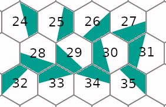
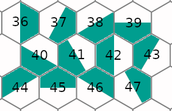

# Введение
Это детальная документация к коду.

Идея детальной документации заключается в том, что всегда
легко объяснить, что делает функция, но чтобы понять как
она это делает нужно знать множество деталей.

Как говорится "дьявол в деталях". В результате мы в коде
описываем только "что делает каждая функция" и расставляем
ссылки на детали в виде @DetailName. А сами детали мы
описываем в директории details.

Каждая ссылка может быть использована несколько раз.
Мы не переводим комментарии, но можем захотеть перевести
детали на несколько языков.

# @H6PFormat
Формат H6P весьма прост и вероятно напомнит BMP.

Все числа хранятся в Big-Endian формате.

Заголовок 4 байта содержит Magic-последовательность "HexP".

Далее 4 байта &mdash; версия формата (=2).

Ещё 4 байта &mdash; ширина (w).

И 4 байта &mdash; высота (h).

Наконец 4\*w\*h байт информация о каждом гексагональном пикселе.

Информация эта состоит из:

18 старших бит &mdash; цвет из оптимальной палитры (@OptimalPalette)

10 следующих бит &mdash; субпиксельная информация, номер формы дополнительного цвета.

4 младших бит &mdash; субпиксельная информация, номер дополнительного цвета.

# @H6PMask
Номер формы дополнительного цвета кодирует одну из 952 возможных форм.

Все формы складываются из от одной до четырёх непересекающихся областей
гиперпикселя (@HyperMask).

Нулевая форма &mdash; это весь гексагон (49-я область) и означает
отсутствие дополнительного цвета.

Формы 1-48 соответствуют областям от 0 до 47.

Далее с 48 по 653 формы &mdash; всевозможные сочетания непересекающихся
областей 0-47.

Формы 654-773 &mdash; это формы в которых одна из областей инвертирована
и включает в себя меньшую область.

Формы 774-950 &mdash; формы включающие одну из областей с 48 по 53.

Наконец форма 951 соответствует области 54. 

Все формы генерируются в функции gen\_forms модуля hexpict.hyperpixel

# @HexWindow
Окно гексагонального пикселя это картинка расположенная в корне проекта:

и используемая для отображения текущего пикселя на референсном изображении.

# @HyperMask
В шестиугольном пикселе мы выделяем 56 областей.

Все области сгруппированы по подобию и представлены на
следующих 6 рисунках:

В связи с этим для каждого пикселя гиперпикселя
формируется маска принадлежности каждой области.

Маска пикселя &mdash; это 64-хбитное целое число 56 битов которой
соответствует принадлежности одной из областей.

# @HyperPixel
Гиперпиксель &mdash; это представление гексагонального
пикселя в виде некоторого набора обычных пикселей.

Одно из представлений гиперпикселя можно найти
[здесь](https://en.wikipedia.org/wiki/User:Smcgruer).

Важно, чтобы гиперпиксели укладывались на плоскости
квадратной сетки из обычных пикселей
не оставляя зазоров. В связи с этим не для каждой
ширины удаётся (@HyperPixelSuccess) сгенерировать
симметричный гиперпиксель.

# @HyperPixelSuccess
Итак как было отмечено в @HyperPixel не для каждой
ширины удаётся сгенерировать симметричный гиперпиксель
так чтобы замостить пиксельную сетку без зазоров.

Для проверки отсутствия зазоров мы проверяем поочерёдно
соответствие ширины каждой линии гиперпикселя ширине
пространства между двумя уложенными рядом гиперпикселями.
