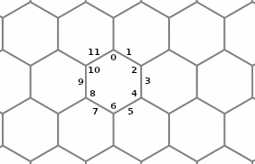

# Введение
Это детальная документация к коду.

Идея детальной документации заключается в том, что всегда
легко объяснить, что делает функция, но чтобы понять как
она это делает нужно знать множество деталей.

Как говорится "дьявол в деталях". В результате мы в коде
описываем только "что делает каждая функция" и расставляем
ссылки на детали в виде @DetailName. А сами детали мы
описываем в директории details.

Каждая ссылка может быть использована несколько раз.
Мы не переводим комментарии, но можем захотеть перевести
детали на несколько языков.

# @Palette
Палитра в программе состоит из 12 редактируемых цветов,
выбирается клавишами от "1" до "=" и отображается
квадратиками внизу экрана, текущий из которых увеличен.

# @Pen
Единственный реализованный инструмент в программе &mdash;
перо. Перо можно опустить удержанием клавиши H, при
этом клавиши навигации позволяют окрашивать (изменение
базового цвета) пиксели при движении.

# @Pictures
Редактор позволяет открывать до 12 изображений, которые
хранятся в массиве pictures и текущая картинка обозначается
индексов в этом массиве pict.

# @PictureView
Картинка хранимая изначально в файле в формате H6P читается,
хранится в памяти в расширенном формате представляющем собой
два изображения image и mask, рендерится в текстуру с определённым
размером гиперпикселя.

При этом размер гиперпикселя и часть отображаемого на экране
вида изменяется следующими клавишами:

O, P &mdash; влево-вправо
Q, A &mdash; вверх-вниз
W, S &mdash; увеличение-уменьшение размера гиперпикселя

# @PictureWithReference
В общем случае картинка может быть открыта с референсным
изображением, которое отображается в правой половине экрана.
При этом задаются имя файла (png или jpg) координаты некоторой
центральной точки (например центр зрачка на референсном
изображении), размер точки в пикселях на референсном изображении.

# @PixArea
В @Areas вы познакомились с массивами pixareas1-pixareas4
описывающими области (@HyperMask) для гиперпикселей шириной 3 и 4.

Однако чтобы из областей получить формы (@H6PMask), необходимо
сложить несколько чисел (это можно сделать, т.к. все области
в формах не пересекаются) из массивов pixareas1-pixareas4.

Для хранения информации о форме формируется массив pixarea.

# @PointsOfHexagon
У шестиугольника мы выделяем 12 точек, в точности
как у циферблата часов.

Чётные при этом соответствуют вершинам шестиугольника,
а нечётные &mdash; серединам граней.
