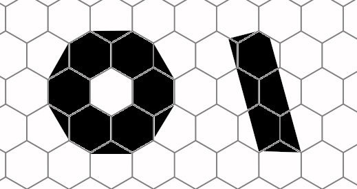

# Введение
Это детальная документация к коду.

Идея детальной документации заключается в том, что всегда
легко объяснить, что делает функция, но чтобы понять как
она это делает нужно знать множество деталей.

Как говорится "дьявол в деталях". В результате мы в коде
описываем только "что делает каждая функция" и расставляем
ссылки на детали в виде @DetailName. А сами детали мы
описываем в директории details.

Каждая ссылка может быть использована несколько раз.
Мы не переводим комментарии, но можем захотеть перевести
детали на несколько языков.

# @Save
Сохранение производится клавишей X. Имя сохранённого
файла совпадает с именем открытого файла (если файл не новый)
и хранится в массиве filenames под тем же индексом
что и картинка в массиве pictures.

# @Scales
Массив масштабов scales представляет собой часть вывода
команды "hex2pixel -l" программы hexpict.

Это возможные размеры гиперпикселя. Индекс в этом массиве
scale &mdash; масштаб или если угодно номер масштаба.

# @ScreenSize
Размер экрана &mdash; структура прямоугольника,
элементы w и h которой инициализируются размером SDL-окна
при старте приложения (код инициализации содержится
в конструктуре модуля h6pedit.global\_state).

# @SDLDeinit
Деинициализация всех модулей SDL на выходе из приложения.

# @SDLEvents
События SDL представляют собой структуру с информацией
обо всех нажатиях/отжатиях клавиш на клавитуре или мыше,
передвижениях мыши, сворачивании окна.

Мы в первую очередь обрабатываем клавиатуру.
Обработка мыши пока не реализована.

# @SDLImageInit
Библиотека SDL Image используется нами исключительно
для подгрузки референсных изображений. Тем не менее
мы стараемся инциализировать поддержку максимального
числа форматов.

# @SDLInit
Иницализация библиотеки DerelictSDL2 (это обёртка
над SDL для D), самой библиотеки SDL с поддержкой
видео и таймера, вызов прочих инициализирующих
функций &mdash; всё в это функции.

# @SDLRenderer
Здесь мы инициализируем рендерер с поддержкой аппаратного ускорения,
рендеринга в текстуру, двойной буферизацией и установкой
режима Blend'инга.

# @SDLWindow
Мы создаём полноэкранное окно с изменяемым размером.

# @Selection
Текущий курсор может быть перемещён клавишами навигации
Y, U, J, N, B, G. Его инвертированное изображение
хранится в изображении selection. H6P-координаты
хранятся в структуре прямоугольника select.

Также H6P-координаты выбранного цвета на палитре
при выборе цвета хранится в переменной colors\_select.

# @SmallScaleNotes
Для формирования картинки с малым размером гиперпикселя,
мы используем информацию о площади формы из pixarea (@PixArea).

Площадь базового цвета мы умножаем на базовый цвет
и складываем с площадью дополнительного цвета помноженного на
дополнительный цвет. Разделив это на полную площадь пикселя
получаем цвет пикселя.

# @Story
Всё началось с того, что я заинтересовался гексагональными
пикселями. В самом деле почему бы пикселям не быть не квадратными,
а шестиугольными?

Порыскав в Интернете, я обнаружил некий интерес к теме,
но полное отсутствие инструментов для создания
гексагонального пиксель-арта.

А так хотелось увидеть гексагональный пиксель-арт, но
кроме одной единственной игрушки ничего не было.

Я начал копать в этом направлении. Но захотелось улучшений.
Во-первых в гексагональном пиксель-арте не возможны ровные
вертикальные линии. И я решил усовершенствовать идею
добавлением субпиксельной информации. Теперь
у гексагонального пикселя фактически 2 цвета. Базовый
и дополнительный, которым закрашивается некая форма (@H6PMask).

В результате в моём гексагональном пиксель-арте возможны
прямые линии аж в 12 направлениях (каждые 15 градусов).

Например вот окружность в 1,5 пикселя радиусом и линия с наклоном в 15 градусов:

Этот проект пока не редактор, но конвертор.
Продолжение следует.

